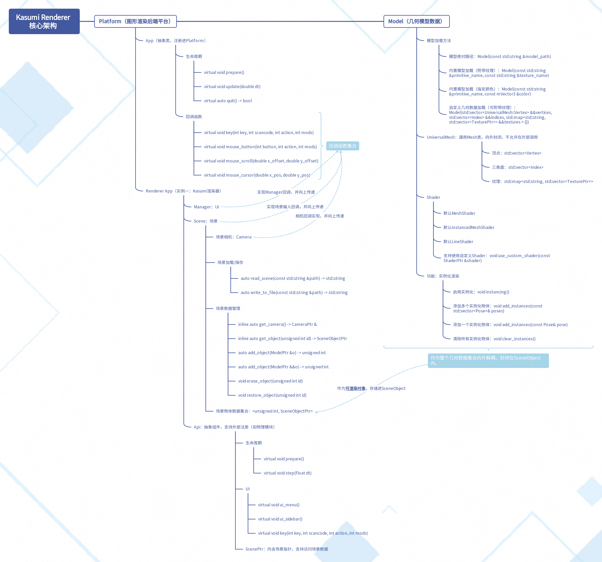
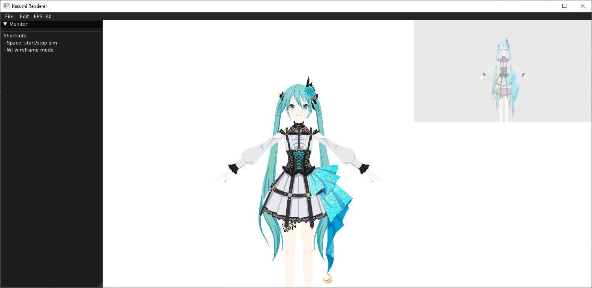

# HinaPE 开发指南 - 中文

## 简介：

HinaPE是一个建立以Kasumi Renderer为后端建立起的物理模拟平台。

## Kasumi 渲染后端

### 核心架构：



### 文件结构

- `backends`：通用渲染后端，所有与OpenGL（或其他图形API）相关的功能类全部被封装在这里。
- `common`：通用数学/几何库。一个大项目只需要依赖一个common就可以了。如果Kasumi渲染器外面还有工程包含它，那么这个common是不使用的，而是会使用外面那个common。（比如HinaPE便是）
- `renderer app`：通用渲染器，一个App的实例。这个层级不关心渲染后端的实现（如OpenGL等），完全解耦，支持场景、UI等操作。

### Backends：通用渲染后端

#### 设计思想

1. 要绝对解耦。尽可能做到最大的复用性。
   - 要与外部解耦。比如Kasumi渲染器、HinaPE等。不能依赖除了数学函数之外任何外部的东西。
   - 要与自己解耦。同在backends后端下的文件之间，也要尽可能解耦，尽可能每个文件都可以单独引用。如果做不到单独引用，那么依赖链条也必须清晰简洁。
   - 要与图形Api实现解耦。在头文件里不出现任何OpenGL的东西。（注：GLFW窗口实质上是系统层级的，并不严格属于OpenGL，因为OpenGL、Vulkan、Metal等图形API都可以使用GLFW的窗口。所以GLFW是被允许在头文件中出现的。）
2. 要尽最大的可能封装起来。
   - 比如`Model`。一旦编写完成，外部的调用（比如Kasumi Renderer）就只需要在Model层级进行操作，不需要深入`UniversalMesh`这一层级，也不需要写任何GL开头的指令。
   - 再比如`Platform`。作为一个通用图形渲染后端，我们可以发现Platform的头文件没有依赖除了标准库外的任何库。这样的封装使得扩展开发变得特别容易。

#### 文件依赖关系

| File          | Dependency                   |
| ------------- | ---------------------------- |
| `camera`      | math_api                     |
| `framebuffer` | shader                       |
| `mesh`        | math_api/shader/texture      |
| `model`       | math_api/shader/texture/mesh |
| `platform`    | /                            |
| `pose`        | math_api                     |
| `shader`      | math_api                     |
| `texture`     | /                            |

可以看到，backends中的所有文件的依赖结构都简单。由于math_api可完全自定义实现（比如使用自己的Vector或者Matrix等），在这里的所有的文件均可单独作为一个完整的模块任何项目被引入。

#### Built-in资源

我们注意到，在`backends`文件夹下面还有一个`assets`文件夹。这里存储了方便开发者使用的**<u>内置</u>**资源。包括模型，场景和内置Shader。

在`backends`的根目录下的`CMakeLists.txt`的最末尾定义了四个Built-in宏

- `BuiltinSceneDir`
- `BuiltinModelDir`
- `BuiltinShaderDir`
- `BuiltinTextureDir`

这将允许我们在**<u>任何地方</u>**随时找到并调用Built-in的资源。

## 快速上手

实践是掌握Kasumi渲染后端最快的办法。我们将简单进行几个扩展练习。

### 一：从零开始，使用Kasumi Renderer渲染一个自定义模型

#### 建立CMake项目

在`examples`下新建一个文件夹`kasumi-from-scratch`（其实，我们可以在任何文件夹下新建）。

作为一个CMake建构的项目，第一步需要编写一个`CMakeLists.txt`来组织起我们的工程。在`kasumi-from-scratch`下新建一个`CMakeLists.txt`，然后简单写入：

```cmake
# HinaPE使用现代CMake，因此必须支持3.16及以上版本的Cmake
cmake_minimum_required(VERSION 3.16)

# 新建一个独立的Project，并指定为C++的Project（如果不指定，编译器将有概率将程序误判为C工程，导致部分文件无法编译）。
project(KasumiFromScratch LANGUAGES CXX)

# 添加一个可执行文件，编译源文件指定为main.cpp api.h api.cpp这三个文件。
add_executable(KasumiFromScratch main.cpp)

# HinaPE积极拥抱现代的C++，因此，我们将使用C++20标准。
set_target_properties(KasumiFromScratch PROPERTIES CXX_STANDARD 20 CXX_EXTENSIONS ON)

# 将Kasumi_renderer链接进KasumiFromScratch这个Target。这样，KasumiFromScratch就可以使用Kasumi_renderer的全部功能了（包括Kasumi_renderer自己定义的头文件也会被链式法则引入到KasumiFromScratch）。
target_link_libraries(KasumiFromScratch PUBLIC Kasumi_renderer)

# 为了方便，我们添加一个我们自己的Asset的文件夹的宏。
target_compile_definitions(
        KasumiFromScratch
        PUBLIC
        -DMyAssetsDir="${CMAKE_CURRENT_SOURCE_DIR}/assets/"
)
```

并且，我们在外部的`examples`中添加我们的新项目，

```cmake
# in examples/CMakeLists.txt
add_subdirectory(kasumi-from-scratch)
```

然后在文件夹下新建并初始化`main.cpp`

```c++
#include <iostream>
auto main() -> int
{
	std::cout << "Hello Kasumi~" << std::endl;
	return 0;
}
```

这样就成功在HinaPE建立起了我们的新项目。

#### Kasumi常用函数调用

接下来我们将在main函数中，使用Kasumi Renderer来实现一些常用的功能。

首先，建立`Kasumi Renderer`的实例。

从前文中我们知道，`Kasumi Renderer`是一个`Platform`下的App的实例。因此，我们特意将Renderer类的文件保留为`app.h`与`app.cpp`。

由于CMake链接的传导性质，我们的文件默认include目录就包括Kasumi渲染器的根目录。所以，我们可以直接include到`Kasumi Renderer`。

```c++
#include "renderer/app.h"
```

接下来，将它实例化。由于我们采用的标准是现代C++标准C++20，因此，我们的代码风格也将与此对应。

```c++
auto kasumi = std::make_shared<Kasumi::Renderer>();
```

我们使用智能指针`shared_ptr`初始化一份Kasumi渲染器实例。

**<u>在`Kasumi::Renderer`实例被创建的同时，整个图形Api后端都会被初始化</u>**。这同样意味着，如果没有初始化一个App（这里是Kasumi::Renderer），任何Backends内的操作都是不被允许的。

在`Kasumi::Renderer`实例中，我们可以得到一个场景

```c++
auto scene = kasumi->get_scene();
```

接下来，我们将加载一个模型（比如：[这个](https://www.aplaybox.com/details/model/O606QHAv4EM2)，并将其放在我们自己的assets目录下。需要注意，不支持中文路径，所以要把`pmx`文件改个名字。），并将其加入到场景中。

```c++
auto miku = std::make_shared<Kasumi::Model>(std::string(MyAssetsDir) + "miku.pmx");

scene->add_object(miku);
```


最后启动Kasumi Renderer App。



### 二：使用扩展Api调用Kasumi Renderer

TODO


### 三：使用扩展App直接注册Platform开发图形程序

（如例：examples/painting2D，一个类似Shadertoy的2DFragment Shader画板）

TODO